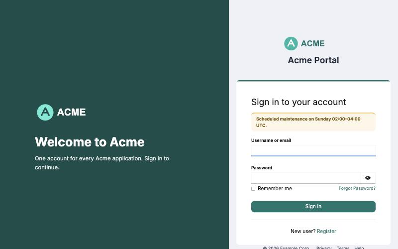
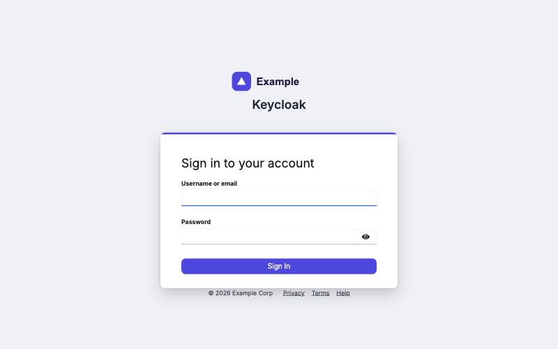
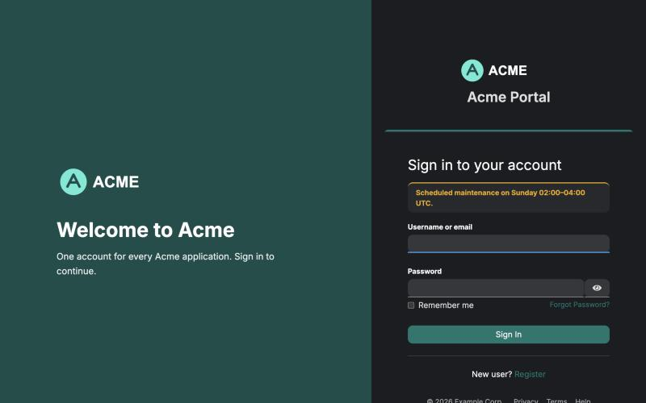
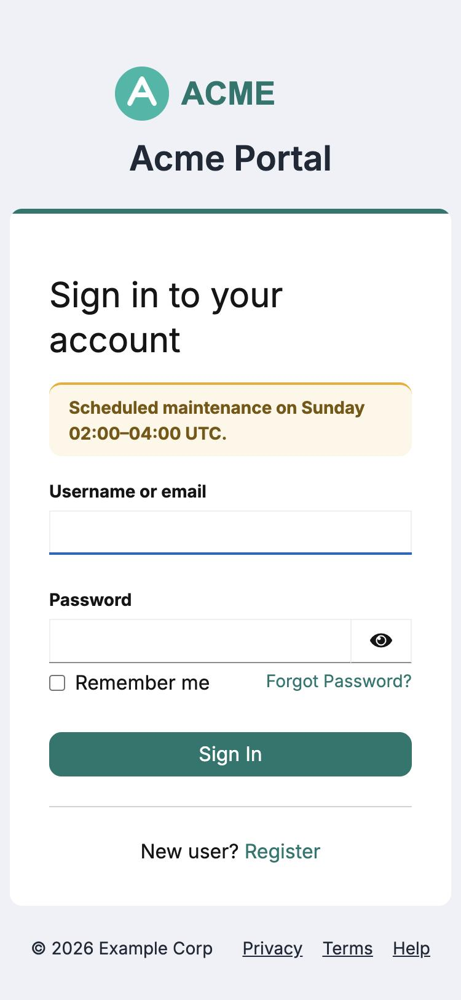
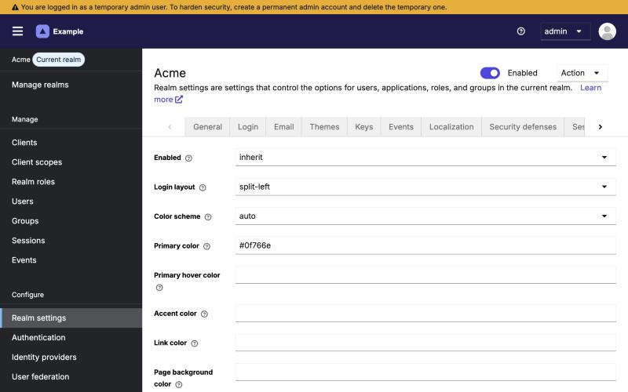
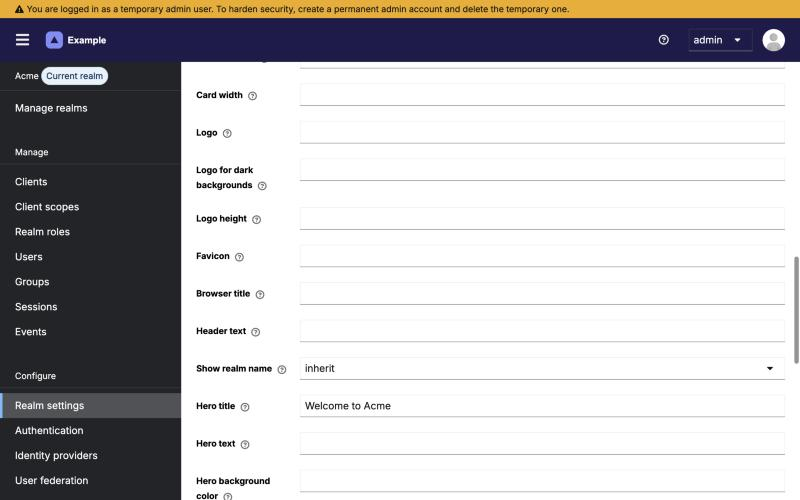
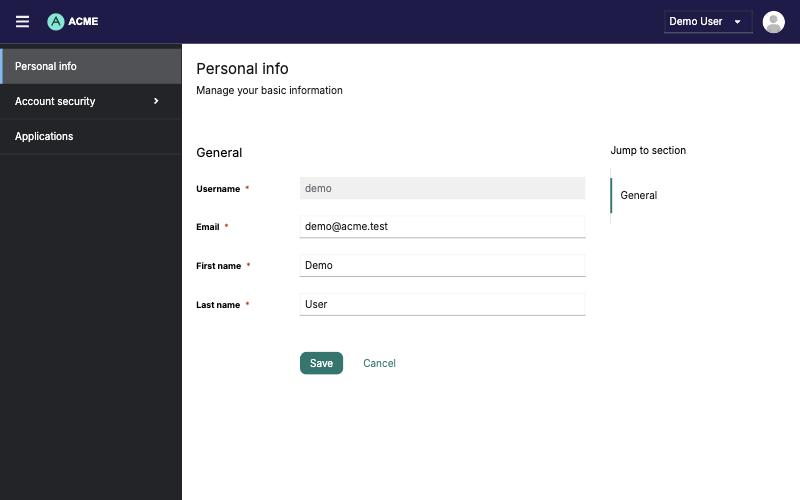
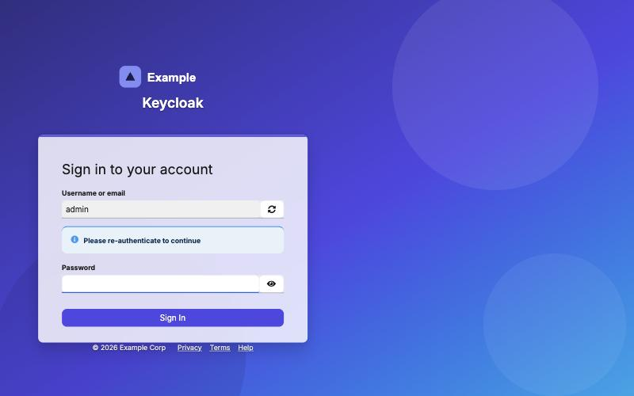
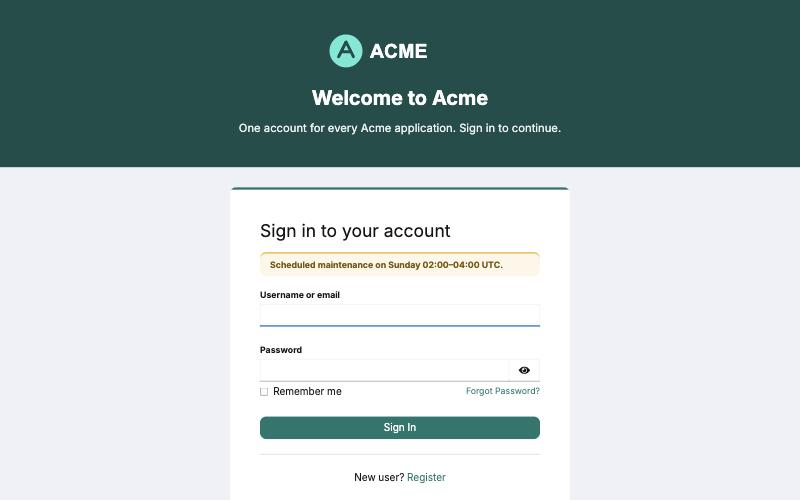

# Keycloak Configurable Theme SPI

[](https://github.com/dockndevai/keycloak-configurable-theme/actions/workflows/ci.yml)
[](https://github.com/dockndevai/keycloak-configurable-theme/actions/workflows/keycloak-compat.yml)
[](https://github.com/dockndevai/keycloak-configurable-theme/releases)
[](https://www.keycloak.org)
[](LICENSE)

One theme for **every realm**. Layout, colours, logo, favicon, fonts, texts, banner, footer, and account/admin console and email branding all come from **configuration**, not from separate theme folders.

Built and tested against **Keycloak 26.8.0** (Java 21).

| Split layout (per-realm config) | Global defaults, centered | Dark mode | Mobile |
|---|---|---|---|
|  |  |  |  |

The same jar and theme produce all four. Only `branding.json` differs per realm.

### Configure it from the admin console

Each realm gets a **Realm settings → Branding** tab. Every field starts as *inherit*; set only what this realm should change. The admin console itself is branded too (logo and header colour above).

| Colours and layout | Logos, texts, banner |
|---|---|
|  |  |

Users see the same branding in the account console:



## How it works

```
                  ┌────────────── branding SPI (BrandingProvider) ──────────────┐
 built-in defaults → conf/branding.json "defaults" → branding.json "realms.<name>" → realm overrides
                  └──────────────────────────────┬──────────────────────────────┘
                                                 │ effective config per realm
     ┌──────────────────────┬────────────────────┼─────────────────────┬──────────────────────┐
 Theme selector        Login forms           Email templates      /realms/{r}/branding    /admin/realms/{r}/branding
 forces "configurable" exposes `branding`    exposes `branding`    theme.css, config.json,  admin REST API (view/manage-realm)
 for every realm       to FreeMarker         (branded HTML)       logo, favicon, assets    + Realm settings → Branding tab
```

| Component | Keycloak SPI | Notes |
|---|---|---|
| `BrandingSpi` / `DefaultBrandingProviderFactory` | custom `branding` SPI | Layers the config, stores realm overrides and assets |
| `ConfigurableThemeSelectorProviderFactory` | `themeSelector` | Returns `configurable` for login, account, admin and email in every realm |
| `BrandingLoginFormsProviderFactory` | `login` | Extends the FreeMarker provider and adds `branding` to every login, error and info page |
| `BrandingEmailTemplateProviderFactory` | `emailTemplate` | Same for emails |
| `BrandingResourceProviderFactory` | `realm-restapi-extension` | Public CSS, assets and console config |
| `BrandingAdminResourceProviderFactory` | `admin-realm-restapi-extension` | Admin API, guarded by Keycloak's realm permissions |
| `BrandingUiTabProviderFactory` | `ui-tab` | Native **Realm settings → Branding** tab |
| `theme/configurable/*` | theme | login (extends `keycloak.v2`), account (`keycloak.v3`), admin (`keycloak.v2`), email (`keycloak`) |

The overriding factories return a positive `order()`, so Keycloak picks them as defaults automatically. No `--spi-...-provider` flags are needed.

## Quick start

```bash
mvn -DskipITs package
```

```bash
docker compose -f docker/docker-compose.yml up
```

- Login with global defaults: <http://localhost:8080/admin> (`admin` / `admin`, local demo only)
- Login with `acme` overrides (split layout): <http://localhost:8080/realms/acme/account> (`demo` / `demo`)
- Edit `docker/branding.json`. Changes apply within the reload interval (5 s in the demo), with no restart.

## Install in your Keycloak

Pick one:

- **Jar:** download `keycloak-configurable-theme-<version>.jar` from [Releases](https://github.com/dockndevai/keycloak-configurable-theme/releases).
- **Docker image** (Keycloak plus the provider, pre-built for PostgreSQL, multi-arch):
  ```bash
  docker run -p 8080:8080 -v ./branding.json:/opt/keycloak/conf/branding.json \
    ghcr.io/dockndevai/keycloak-configurable-theme:latest start --optimized --db-url=... --hostname=...
  ```
  Tags: `<version>`, `<major>.<minor>`, `<version>-kc<keycloak-version>`, `latest`.
- **Maven Central** (to bundle it into your own Keycloak build):
  ```xml
  <dependency>
    <groupId>io.github.dockndevai</groupId>
    <artifactId>keycloak-configurable-theme</artifactId>
    <version>VERSION</version>
  </dependency>
  ```

Then:

1. Copy the jar to `/opt/keycloak/providers/` (not needed with the Docker image).
2. Optionally put a `branding.json` in `/opt/keycloak/conf/` and shared images in `/opt/keycloak/branding/`.
3. Run `kc.sh build` (or `start-dev`), then start Keycloak.
4. Optional: add `--features=declarative-ui` for the admin-console Branding tab (experimental Keycloak feature). Without it, use the REST API.

Keycloak logs `KC-SERVICES0047 ... implementing the internal SPI` for the login, email and REST extensions. This is expected for these SPIs; it means they may change between Keycloak versions, so re-run the integration tests when upgrading.

### SPI options

| Option (CLI / env) | Default | Description |
|---|---|---|
| `--spi-branding--default--config-file` / `KC_SPI_BRANDING__DEFAULT__CONFIG_FILE` | `<kc.home>/conf/branding.json` | Global config file |
| `--spi-branding--default--assets-dir` / `KC_SPI_BRANDING__DEFAULT__ASSETS_DIR` | `<kc.home>/branding` | Shared assets (`<dir>/<realm>/<file>` overrides `<dir>/<file>`) |
| `--spi-branding--default--reload-interval` | `10` | Seconds between checks of the config file for changes |
| `--spi-branding--default--max-asset-size` | `512` | Maximum upload size in KiB |
| `--spi-theme-selector--configurable--theme-name` | `configurable` | Theme forced on all realms |
| `--spi-theme-selector--configurable--types` | `login,account,admin,email` | Which theme types are forced |

## Configuration

### Precedence (lowest → highest)

1. Built-in defaults
2. `branding.json` → `defaults` (all realms)
3. `branding.json` → `realms.<realm-name>`
4. Realm overrides set via the admin REST API or the admin-console tab. They are stored in the realm (attribute `branding.config`), so they live in the database and work in clusters.

An empty value means "inherit from the layer below". Invalid values in the file are logged and ignored, so one typo cannot break the login page. Invalid values sent to the API are rejected with `400`.

### `branding.json`

```json
{
  "defaults": { "primaryColor": "#4f46e5", "logoUrl": "logo.svg", "footerText": "© 2026 Example Corp" },
  "realms":   { "acme": { "layout": "split-left", "heroTitle": "Welcome to Acme", "primaryColor": "#0f766e" } }
}
```

URL settings (`logoUrl`, `logoDarkUrl`, `faviconUrl`, `backgroundImageUrl`, `fontCssUrl`) accept any of:
- an `https://…` URL
- a root-relative `/path`
- an image `data:` URI
- an **asset name** such as `logo.svg`, looked up first in the realm's uploaded assets, then in `<assets-dir>/<realm>/`, then in `<assets-dir>/`

### All settings

| Key | Type | Default | Description |
|---|---|---|---|
| `enabled` | boolean | `true` | Enabled. Apply the configurable theme to this realm. When off, the realm's own theme settings are used. |
| `layout` | layout (centered / split-left / split-right / minimal, or a custom layout name) | `centered` | Login layout. Built-in, or a [custom layout](#custom-layouts-no-rebuild) plugged in at runtime. |
| `colorScheme` | enum (auto / light / dark) | `auto` | Color scheme. auto follows the browser preference; light/dark force one scheme. |
| `primaryColor` | color | `#0066cc` | Primary color. Buttons and highlights. |
| `primaryHoverColor` | color | — | Primary hover color. Leave empty to derive it from the primary color. |
| `accentColor` | color | — | Accent color. Top border of the login card. Defaults to the primary color. |
| `linkColor` | color | — | Link color. Defaults to the primary color. |
| `backgroundColor` | color | `#eef1f6` | Page background color |
| `backgroundImageUrl` | url | — | Page background image. URL, data URI or uploaded asset name. |
| `backgroundOverlay` | color | — | Background overlay. Translucent color laid over the background image, e.g. rgba(0,0,0,0.4). |
| `cardBackgroundColor` | color | `#ffffff` | Card background color. Login card background in light mode. |
| `textColor` | color | `#151515` | Text color. Body text in light mode. |
| `headerTextColor` | color | `#1f2937` | Header text color. Realm name shown above the card. |
| `fontFamily` | font | — | Font family. CSS font-family list, e.g. 'Inter', sans-serif. |
| `fontCssUrl` | url | — | Font stylesheet URL. Stylesheet that defines the font, e.g. a Google Fonts URL. |
| `borderRadius` | size | `8px` | Corner radius. Buttons, inputs and card. |
| `cardWidth` | size | `34rem` | Card width. Maximum width of the login card. |
| `logoUrl` | url | — | Logo. URL, data URI or uploaded asset name. |
| `logoDarkUrl` | url | — | Logo for dark backgrounds. Used in dark mode, on the split-layout side panel and in the console header. Defaults to the logo. |
| `logoHeight` | size | `56px` | Logo height |
| `faviconUrl` | url | — | Favicon. URL, data URI or uploaded asset name. |
| `pageTitle` | text | — | Browser title. Replaces the browser tab title. |
| `headerText` | text | — | Header text. Replaces the realm display name above the card. |
| `showRealmName` | boolean | `true` | Show realm name. Show the header text next to / below the logo. |
| `heroTitle` | text | — | Hero title. Headline of the side panel in split layouts. |
| `heroText` | text | — | Hero text. Paragraph of the side panel in split layouts. |
| `heroBackgroundColor` | color | — | Hero background color. Side panel color in split layouts. Defaults to the primary color. |
| `infoBanner` | text | — | Announcement banner. Message shown at the top of every login page. |
| `infoBannerType` | enum (info / success / warning / danger) | `info` | Banner type |
| `footerText` | text | — | Footer text. Shown below the login card and in emails. |
| `footerLinks` | links | — | Footer links. Entries as Label\|https://url separated by ';' or new lines. |
| `applyToAccount` | boolean | `true` | Brand the account console |
| `applyToAdmin` | boolean | `true` | Brand the admin console. Takes effect on the realm that hosts the admin console (normally master). |
| `applyToEmail` | boolean | `true` | Brand emails |
| `consoleHeaderColor` | color | — | Console header color. Masthead color of the account and admin consoles. |
| `customCss` | css | — | Custom CSS. Appended to the generated stylesheet for every page. |

### Layouts

- `centered`: the stock card, centred on the page background (colour or image, with an optional overlay).
- `split-left` / `split-right`: a hero panel (logo, title, text, background image) beside the form. Below 900px it collapses to one column.
- `minimal`: no card chrome; the form sits directly on the page.

Light and dark mode both work. `colorScheme` can force either one, and `logoDarkUrl` supplies a logo for dark surfaces.

### Custom layouts (no rebuild)

A layout is a CSS file. Add one and it becomes selectable straight away: no rebuild, no restart.

| `card-left` (extends `centered`) | `banner-top` (extends `split-left`) |
|---|---|
|  |  |

Both examples are in [`docker/assets/layouts/`](docker/assets/layouts).

**1. Write the CSS.** Start the file with an `extends` comment naming a built-in layout, then style the class `cfg-layout-<name>`:

```css
/* extends: centered */
body.cfg-layout-card-left .pf-v5-c-login__container { justify-content: start; padding-inline-start: 6vw; }
body.cfg-layout-card-left .pf-v5-c-login__main { backdrop-filter: blur(14px); }
```

The page gets both classes (`cfg-layout-centered cfg-layout-card-left`), so you only write what differs. Extending `split-left` or `split-right` also gives you the hero panel markup (`.cfg-hero`, `.cfg-hero__logo`, `.cfg-hero__title`, `.cfg-hero__text`). All `--cfg-*` colour and size variables are available. Without an `extends` line, the base is `centered`.

**2. Plug it in**, in any of these ways:

| Where | Scope | Notes |
|---|---|---|
| `<assets-dir>/layouts/<name>.css` | all realms | Drop the file onto the server or mount it. Edits apply on the next page load. |
| `<assets-dir>/<realm>/layouts/<name>.css` | one realm | Overrides a global layout of the same name. |
| `PUT /admin/realms/{realm}/branding/layouts/<name>` (body: the CSS) | one realm | Stored in the database, so it works in clusters. Needs `manage-realm`. |

```bash
curl -X PUT -H "Authorization: Bearer $TOKEN" -H "Content-Type: text/css" \
  --data-binary @card-left.css http://localhost:8080/admin/realms/acme/branding/layouts/card-left
```

**3. Select it** with `"layout": "card-left"` in `branding.json`, the Branding tab or the API. `GET /admin/realms/{realm}/branding/layouts` lists what's available.

Rules:
- Names use lowercase letters, digits and dashes, and can't replace a built-in layout.
- The API and the Branding tab reject a layout that doesn't exist.
- If a selected layout is later removed, the page falls back to `centered` and logs a warning; it never breaks the login page.
- Layout CSS is served as a separate `text/css` file, never inlined into HTML, with a 100 KiB limit.

## Admin REST API

All endpoints use a normal admin bearer token. Reads need `view-realm`, writes need `manage-realm`, the same as the built-in realm settings. Changes are recorded as admin events.

| Method & path | Description |
|---|---|
| `GET /admin/realms/{realm}/branding` | `{ overrides, effective, version }` |
| `GET /admin/realms/{realm}/branding/schema` | Field catalogue (key, type, default, options) |
| `PUT /admin/realms/{realm}/branding` | Replace all realm overrides |
| `PATCH /admin/realms/{realm}/branding` | Merge keys; an empty string removes a key |
| `DELETE /admin/realms/{realm}/branding` | Remove all realm overrides |
| `GET /admin/realms/{realm}/branding/assets` | List uploaded assets |
| `PUT /admin/realms/{realm}/branding/assets/{name}` | Upload a binary asset (png, jpg, gif, webp, svg, ico, woff/woff2/ttf/otf) |
| `DELETE /admin/realms/{realm}/branding/assets/{name}` | Delete an uploaded asset |
| `GET /admin/realms/{realm}/branding/layouts` | Built-in and custom layouts, with their source and base |
| `GET /admin/realms/{realm}/branding/layouts/{name}` | CSS of a custom layout |
| `PUT /admin/realms/{realm}/branding/layouts/{name}` | Upload or replace a custom layout (body: CSS) |
| `DELETE /admin/realms/{realm}/branding/layouts/{name}` | Delete an uploaded layout |

```bash
TOKEN=$(curl -s -d client_id=admin-cli -d username=admin -d password=admin -d grant_type=password \
  http://localhost:8080/realms/master/protocol/openid-connect/token | jq -r .access_token)
```

```bash
curl -X PUT -H "Authorization: Bearer $TOKEN" -H "Content-Type: image/svg+xml" \
  --data-binary @logo.svg http://localhost:8080/admin/realms/acme/branding/assets/logo.svg
```

```bash
curl -X PATCH -H "Authorization: Bearer $TOKEN" -H "Content-Type: application/json" \
  -d '{"logoUrl":"logo.svg","layout":"split-right","infoBanner":"Maintenance tonight"}' \
  http://localhost:8080/admin/realms/acme/branding
```

The **Realm settings → Branding** tab (with `declarative-ui` enabled) edits the same overrides. Every field starts as *inherit*, so saving the form only pins the values you changed. Changes made through the REST API also show up in the tab.

### Public endpoints

`/realms/{realm}/branding/theme.css`, `config.json`, `logo`, `favicon`, `background`, `assets/{name}` and `layouts/{name}.css`. They serve only presentation data that is already visible on the login page. They support ETags and caching, and SVGs are served with a locked-down `Content-Security-Policy` and `nosniff`.

## Consoles and email

- **Account console** (`/realms/{realm}/account`) and **admin console**: a small loader script applies the realm's generated CSS, logo, favicon, fonts and colour scheme. The admin console is branded with the config of the realm that hosts it (normally `master`). Turn this off per realm with `applyToAccount` / `applyToAdmin`.
- **Emails**: every HTML email is wrapped in a branded layout (logo, primary colour, footer text). The message texts stay Keycloak's own. Turn this off with `applyToEmail`.
- `enabled: false` gives a realm back its own theme settings.

## Security notes

- Every value that ends up in CSS is checked against a strict grammar: colours, lengths, font lists and URLs without quotes or parentheses. Values cannot break out of a declaration; unit tests cover injection attempts.
- Template texts are HTML-escaped by FreeMarker. Footer links only allow `http(s)`, `mailto:` and root-relative URLs.
- `customCss` is free-form by design. Only realm admins (`manage-realm`) can set it, and it is served as `text/css`, never inlined into HTML.
- Asset names are restricted to simple file names with image or font extensions. Content types come from the extension, and paths are confined to the assets directory.

## Development and tests

```bash
mvn verify
```

- **Unit tests** (51): validation and injection cases, config layering, CSS generation, hot reload of the config file.
- **Integration tests** (11, need Docker): start `quay.io/keycloak/keycloak:26.8.0` with the packaged jar via Testcontainers and check:
  - theme enforcement on new realms
  - file defaults and per-realm sections
  - admin API, validation and 401s
  - asset upload, serving and traversal protection
  - CSS ETags
  - the account console loader and opt-outs
  - plug-in layouts from the assets directory and the API, including fallback when a layout is removed
  - a branded HTML email delivered to a Mailpit SMTP container

Skip the integration tests with `-DskipITs`. To test another Keycloak version, use `-Dkeycloak.version=…`.

The docker-compose setup disables theme caching, so template and CSS edits show up after `mvn package` and a container restart. Restart the container whenever you rebuild the jar: Keycloak keeps the mounted jar open and fails to read resources from a file that was replaced underneath it.

## Releases and CI

- **CI** (`ci.yml`): every push and PR runs the unit and integration tests and builds the Docker image.
- **Release** (`release.yml`): pushing a `vX.Y.Z` tag runs the full test suite, then publishes:
  - a GitHub Release with the jar and `SHA256SUMS`
  - a multi-arch image to GHCR
  - the artifact to Maven Central, once credentials are configured
- **Compatibility** (`keycloak-compat.yml`): runs the integration tests every week against the newest Keycloak release and the `nightly` image, and opens an issue if they fail.
- **Dependabot** opens PRs for new Keycloak versions; CI tests each one.

See [RELEASING.md](RELEASING.md) for the steps and [CHANGELOG.md](CHANGELOG.md) for history.

## License

[Apache License 2.0](LICENSE), the same license as Keycloak.
